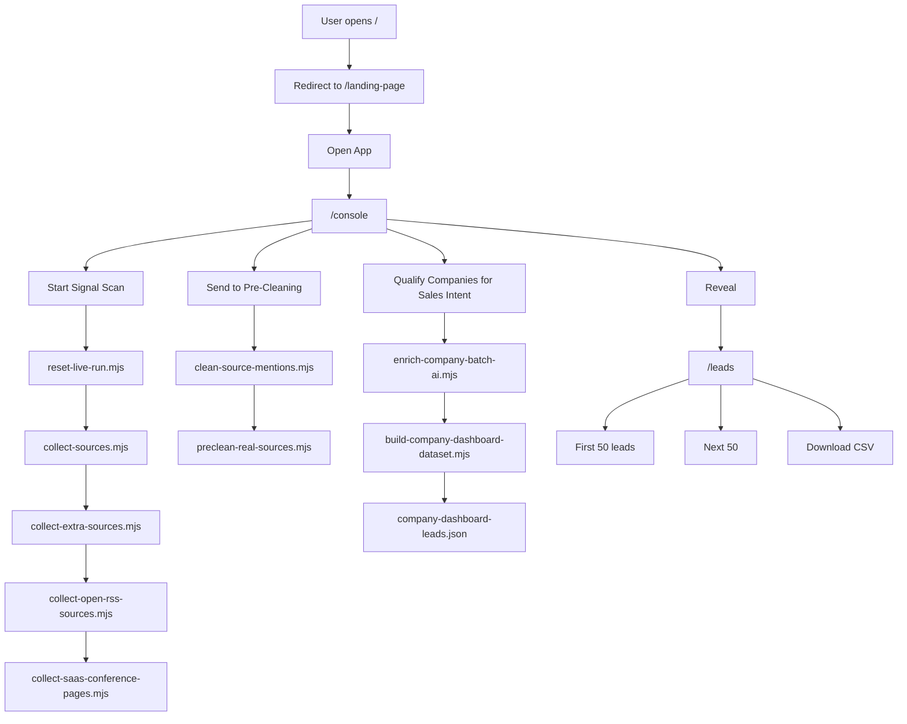
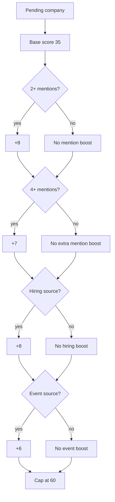

# LeadGrid — Lead Signal Intelligence POC

LeadGrid is a local Next.js proof of concept for turning public buying signals into a sales-ready lead queue.

The product is designed for a company selling appointment-setting, outbound sales support, lead generation support, SDR support, and outbound infrastructure. The goal is to help the user find companies that may be worth contacting based on public signals such as hiring, event participation, sponsor/exhibitor pages, and public company/activity pages.

This README documents the current working logic, data flow, routes, scripts, APIs, scoring behavior, source coverage, and queue behavior.

---

## 1. Product Summary

LeadGrid has three main screens:

| Route | Purpose |
|---|---|
| `/` | Redirects to `/landing-page` |
| `/landing-page` | Marketing/entry page with Open App CTA |
| `/console` | Runs the real pipeline: scan, pre-clean, qualify |
| `/leads` | Shows the current lead queue with Next 50 and CSV export |

The intended user flow is:

```text
Landing Page
  -> Open App
  -> Console
  -> Start Signal Scan
  -> Send to Pre-Cleaning
  -> Qualify Companies for Sales Intent
  -> Reveal
  -> Leads Queue
  -> Next 50 / Download CSV
```

---

## 2. Current High-Level Architecture



---

## 3. Fresh Run Logic

A fresh run is started by:

```bash
node scripts/reset-live-run.mjs
```

This creates:

```json
{
  "runId": "run_YYYYMMDDHHMMSS",
  "startedAt": "ISO timestamp"
}
```

Stored in:

```text
data/current-live-run.json
```

It also clears the previous reviewed queue:

```text
data/ai-enriched-company-leads.json
data/ai-enriched-company-leads.csv
data/company-dashboard-leads.json
data/company-dashboard-leads.csv
data/raw-company-mentions.json
data/leadgrid-visible-state.json
```

The purpose is to guarantee that a new UI scan does not reuse an old reviewed queue.

### Why this matters

Earlier versions reused `ai-enriched-company-leads.json`, which made the lead queue appear to come from old scoring. The reset script now clears old reviewed/scored data before each new signal scan.

Current proof of freshness is:

```text
Already AI-enriched companies: 0
Total AI-enriched companies saved: 50
All queue rows have same runId
```

---

## 4. Main Pipeline Flow

### Step 1 — Signal Scan

Triggered from `/console` by clicking:

```text
Start Signal Scan
```

Backend API:

```text
POST /api/run-pipeline-step
```

With step:

```json
{ "step": "collect_sources" }
```

Current behavior:

```text
reset-live-run.mjs
collect-sources.mjs
```

Then additional scan steps run through UI:

```json
{ "step": "collect_extra" }
{ "step": "collect_saas" }
```

These add more public sources.

Output files:

```text
data/real-source-mentions.json
data/real-source-mentions.csv
```

---

### Step 2 — Pre-Clean

Triggered from `/console` by clicking:

```text
Send to Pre-Cleaning
```

Backend API:

```text
POST /api/run-pipeline-step
```

With step:

```json
{ "step": "preclean" }
```

Current scripts:

```text
scripts/clean-source-mentions.mjs
scripts/preclean-real-sources.mjs
```

Output files:

```text
data/real-source-mentions-preclean.json
data/real-source-mentions-rejected-preclean.json
```

---

### Step 3 — Qualification / Sales Intent Review

Triggered from `/console` by clicking:

```text
Qualify Companies for Sales Intent
```

Backend API:

```text
POST /api/run-pipeline-step
```

With step:

```json
{ "step": "qualify" }
```

Current scripts:

```text
scripts/enrich-company-batch-ai.mjs
scripts/build-company-dashboard-dataset.mjs
```

Output files:

```text
data/ai-enriched-company-leads.json
data/ai-enriched-company-leads.csv
data/company-dashboard-leads.json
data/company-dashboard-leads.csv
data/raw-company-mentions.json
```

---

### Step 4 — Reveal

Triggered from `/console` by clicking:

```text
Reveal
```

This sends the user to:

```text
/leads
```

`/leads` reads from:

```text
GET /api/leads
```

---

## 5. Route Documentation

### `/`

The root route redirects to:

```text
/landing-page
```

File:

```text
app/page.tsx
```

Current behavior:

```tsx
import { redirect } from "next/navigation";

export default function HomePage() {
  redirect("/landing-page");
}
```

---

### `/landing-page`

Public-facing entry screen.

Purpose:

```text
Introduce LeadGrid
Open App CTA
Route user into /console
```

CTA text:

```text
Open App
```

---

### `/console`

Operational control room.

Main actions:

```text
Start Signal Scan
Send to Pre-Cleaning
Qualify Companies for Sales Intent
Reveal
```

Console cards should show short user-friendly language:

```text
Signal Scan
Jobs
Web
Events

Pre-Clean
Read
Clean
Accept
Ready

Intent Score
Review
Score
Queue
Ready
```

Console must avoid developer terms such as:

```text
Gemini
script
.mjs
AI enrichment
local script
```

Backend calls are real and use:

```text
POST /api/run-pipeline-step
```

---

### `/leads`

Lead queue UI.

Reads:

```text
GET /api/leads
```

Shows:

```text
Current visible 50 leads
Reviewed leads first
Pending leads after reviewed leads
Next 50 control
Download CSV
Next Action per card
```

The queue is not limited to AI-reviewed companies only. It keeps pending companies in the queue so raw signals do not collapse into a tiny list.

---

## 6. API Route Documentation

### `POST /api/run-pipeline-step`

Main pipeline API.

Expected request body:

```json
{
  "step": "collect_sources"
}
```

Supported steps:

| Step | Scripts |
|---|---|
| `collect_sources` | `reset-live-run.mjs`, `collect-sources.mjs` |
| `collect_extra` | `collect-extra-sources.mjs`, `collect-open-rss-sources.mjs` |
| `collect_saas` | `collect-saas-conference-pages.mjs` |
| `preclean` | `clean-source-mentions.mjs`, `preclean-real-sources.mjs` |
| `qualify` | `enrich-company-batch-ai.mjs`, `build-company-dashboard-dataset.mjs` |

Expected response shape:

```json
{
  "ok": true,
  "step": "qualify",
  "runAt": "ISO timestamp",
  "logs": [],
  "sourceStats": {},
  "precleanStats": {},
  "qualificationStats": {}
}
```

Important behavior:

```text
No cached output
Runs local scripts in real time
Parses stdout for user-facing ticks
Returns real counts from data files
```

---

### `GET /api/leads`

Reads the latest queue from:

```text
data/company-dashboard-leads.json
```

Reads page state from:

```text
data/leadgrid-visible-state.json
```

Returns:

```json
{
  "leads": [],
  "meta": {
    "dataVersion": 1781869043627.0542,
    "totalAvailable": 993,
    "totalPages": 20,
    "currentPage": 0,
    "maxUnlockedPage": 0,
    "pageSize": 50,
    "visibleStart": 1,
    "visibleEnd": 50,
    "visibleLeadCount": 50,
    "scoredVisibleLeads": 50,
    "hiddenLeft": 943,
    "canGoPrev": false,
    "canGoNext": false,
    "canUnlockNext": true,
    "nextStart": 51,
    "nextEnd": 100
  }
}
```

Sorting behavior:

```text
Reviewed leads first
Then higher score
Then more mentions
Then newer capturedAt
```

---

### `POST /api/reveal-leads-next`

Moves the queue to the next 50.

Purpose:

```text
Unlock/show the next page of leads
Move from 1-50 to 51-100, then 101-150, etc.
```

Updates:

```text
data/leadgrid-visible-state.json
```

Expected state shape:

```json
{
  "currentPage": 1,
  "maxUnlockedPage": 1,
  "pageSize": 50
}
```

---

### `GET /api/leads-csv`

Exports current visible lead page as CSV.

Reads:

```text
data/company-dashboard-leads.json
data/leadgrid-visible-state.json
```

Exports only the current visible page, not all 993 rows.

---

## 7. Data File Documentation

### `data/current-live-run.json`

Tracks the current fresh run.

Example:

```json
{
  "runId": "run_20260619113543",
  "startedAt": "2026-06-19T11:35:43.490Z"
}
```

Every row in the lead queue should carry this same `runId`.

---

### `data/real-source-mentions.json`

Raw extracted source mentions.

Contains broad extraction from:

```text
job boards
RSS sources
conference pages
sponsor pages
partner pages
event pages
```

This is intentionally broad and may include noisy names. The pipeline does not try to perfectly filter here.

---

### `data/real-source-mentions.csv`

CSV version of raw mentions.

---

### `data/real-source-mentions-preclean.json`

Lightly cleaned companies ready for qualification.

This is the main input to AI scoring.

---

### `data/real-source-mentions-rejected-preclean.json`

Obvious garbage rejected during pre-clean.

Examples:

```text
Header
Footer
Download on the App Store
Scroll to top
JSON
```

---

### `data/ai-enriched-company-leads.json`

Companies reviewed/scored by Gemini.

This file is reset on every fresh run.

A single qualification batch usually reviews 50 companies.

---

### `data/company-dashboard-leads.json`

Main queue shown in `/leads`.

This includes:

```text
AI-reviewed companies
Pending companies from current pre-clean data
Scores
Review status
Next action
Run ID
Source data
```

Important: this file now includes pending companies. This prevents the queue from collapsing from 1200 raw signals to only 40-50 visible leads.

---

### `data/leadgrid-visible-state.json`

Controls pagination.

Example:

```json
{
  "currentPage": 0,
  "maxUnlockedPage": 0,
  "pageSize": 50
}
```

---

## 8. Source Coverage

Current extraction sources include:

### Job and hiring sources

| Source | Script | Signal |
|---|---|---|
| Remote OK | `collect-sources.mjs` | Hiring signal |
| Arbeitnow | `collect-sources.mjs` | Hiring signal |
| Remotive | `collect-sources.mjs` | Hiring signal |
| Jobicy | `collect-sources.mjs` | Hiring signal |
| Adzuna Jobs API | `collect-extra-sources.mjs` | Hiring signal |
| We Work Remotely Sales RSS | `collect-open-rss-sources.mjs` | Hiring signal |
| We Work Remotely Support RSS | `collect-open-rss-sources.mjs` | Hiring signal |
| We Work Remotely Programming RSS | `collect-open-rss-sources.mjs` | Hiring signal |

---

### Public company / directory sources

| Source | Script | Signal |
|---|---|---|
| Y Combinator Company Directory | `collect-extra-sources.mjs` | Company activity |
| Product Hunt | `collect-extra-sources.mjs` | Public product activity, may fail with 403 |

---

### Event / conference / sponsor / exhibitor sources

| Source | Script | Signal |
|---|---|---|
| Web Summit Partners | `collect-sources.mjs`, `collect-extra-sources.mjs`, `collect-saas-conference-pages.mjs` | Event / sponsor signal |
| Web Summit Startups | `collect-saas-conference-pages.mjs` | Event/startup signal |
| SaaStr AI Annual | `collect-sources.mjs`, `collect-extra-sources.mjs` | SaaS event signal |
| SaaStr Annual | `collect-saas-conference-pages.mjs` | SaaS event signal |
| SaaStr Events | `collect-saas-conference-pages.mjs` | SaaS event signal |
| SaaStock | `collect-saas-conference-pages.mjs` | SaaS event signal |
| TechCrunch Disrupt | `collect-saas-conference-pages.mjs` | Startup/event signal |
| Dublin Tech Summit | `collect-saas-conference-pages.mjs` | Tech event signal |
| MWC Barcelona Exhibitors | `collect-extra-sources.mjs` | Exhibitor signal |
| Shoptalk Sponsors | `collect-extra-sources.mjs` | Sponsor signal |
| Money20/20 Sponsors | `collect-extra-sources.mjs` | May fail with 404 |
| VivaTech Partners | `collect-extra-sources.mjs` | May fail with 403 |

---

## 9. Extraction Philosophy

LeadGrid intentionally uses broad extraction.

The rule is:

```text
Extract many
Remove only obvious junk
Let qualification/scoring decide quality
```

The extractor does not try to perfectly classify every item as a company. This prevents good leads from being lost too early.

Obvious junk removed early includes:

```text
Header
Footer
Scroll to top
Book Tickets
Download on the App Store
Terms & Conditions
oEmbed JSON
DTS logo image names
Image file names
Pure URLs
Pure numbers
```

Weak-looking company names should not be removed during extraction. They should be scored or rejected later.

---

## 10. Pre-Clean Logic

Pre-clean is intentionally light.

It removes only obvious garbage and prepares companies for qualification.

Current behavior:

```text
Raw rows -> accepted rows + rejected obvious garbage
```

Example from latest valid run:

```text
Raw rows: 1215
Accepted for AI/company scoring: 1188
Hard rejected as obvious garbage: 27
```

This means the pre-cleaner is not aggressively filtering the lead pool.

---

## 11. Qualification / AI Review Logic

Current provider:

```text
Gemini
```

Current model in terminal output:

```text
gemini-3.1-flash-lite
```

The AI reviewer scores companies based on likely fit for a company selling:

```text
appointment-setting
outbound sales support
lead generation support
SDR support
outbound infrastructure
```

AI returns or implies:

```text
score
decision
confidence
fit / reason
next action
```

Typical decisions:

| Decision | Meaning |
|---|---|
| `hot_lead` | Strong fit / strong signal |
| `warm_lead` | Good potential fit |
| `nurture` | Keep for later |
| `research_more` | Needs manual review |
| `trash` | Hide from reviewed queue |
| `review_pending` | Not yet AI reviewed |

---

## 12. Queue Logic

The lead queue is built from current pre-clean companies, not only AI-reviewed companies.

This is important.

Earlier behavior:

```text
1200 raw signals -> 50 reviewed -> 48 visible leads
```

Current behavior:

```text
1200 raw signals -> 50 reviewed + 944 pending -> 993 queue rows
```

Example current run:

```text
Run ID: run_20260619113543
Raw rows: 1215
Pre-clean rows: 1188
Reviewed companies: 50
Queue rows: 993
Reviewed in queue: 49
Pending in queue: 944
```

This means the UI can show a full queue while still marking which leads are reviewed and which are pending.

---

## 13. Pending Lead Scoring Weights

Pending leads are not AI-scored yet. They get a light placeholder score so the UI can sort and display them.

Current logic from `build-company-dashboard-dataset.mjs`:

```text
Base pending score: 35
+8 if company has 2 or more mentions
+7 if company has 4 or more mentions
+8 if source looks like job/hiring/remote/Adzuna
+6 if source looks like event/summit/SaaStr/SaaStock/TechCrunch/Shoptalk/MWC
Maximum pending score: 60
```

This is not the final AI score. It is only a queue ordering helper.



---

## 14. Reviewed Lead Scoring

Reviewed leads use the Gemini-generated score.

General score interpretation:

| Score Range | Queue Decision |
|---|---|
| 85-100 | `hot_lead` |
| 70-84 | `warm_lead` |
| 45-69 | `nurture` |
| 1-44 | `research_more` |
| 0 or trash | Hidden if AI clearly marked trash |

Important: reviewed trash is hidden, but unreviewed pending leads are not hidden.

---

## 15. Sorting Logic

Queue sorting is:

```text
1. Reviewed leads first
2. Higher score first
3. More mentions first
4. Newer capturedAt first
```

This means the first visible page should usually show reviewed leads first, then pending leads.

---

## 16. Next Action Logic

Every lead card should show a next action.

Current logic:

| Lead Type | Next Action |
|---|---|
| Hot lead from hiring source | Prioritize for outreach. Use the active hiring signal as the opener. |
| Hot lead from event source | Prioritize for outreach. Reference the event signal and offer outbound support. |
| Hot lead fallback | Prioritize for outreach and write a direct sales-intent opener. |
| Warm lead | Research the likely buyer, then prepare a warm outbound angle. |
| Nurture | Add to nurture and monitor for a stronger buying signal. |
| Research | Review manually before adding this company to outreach. |
| Pending | Run qualification review first, then decide whether this company should enter outreach. |

---

## 17. CSV Export

CSV export route:

```text
GET /api/leads-csv
```

Export behavior:

```text
Exports current visible page only
Uses current leadgrid-visible-state.json
Does not export all hidden/pending pages unless user navigates there
```

---

## 18. Next 50 Logic

`/leads` shows 50 rows at a time.

State file:

```text
data/leadgrid-visible-state.json
```

Example:

```json
{
  "currentPage": 0,
  "maxUnlockedPage": 0,
  "pageSize": 50
}
```

When user clicks:

```text
Next 50
```

the API updates state to the next page.

Expected metadata:

```json
{
  "visibleStart": 51,
  "visibleEnd": 100,
  "nextStart": 101,
  "nextEnd": 150
}
```

---

## 19. Realness / Freshness Checks

Use this command to verify that the queue is from the current run:

```bash
cat data/current-live-run.json

node -e "const fs=require('fs'); const run=JSON.parse(fs.readFileSync('data/current-live-run.json','utf8')); const raw=JSON.parse(fs.readFileSync('data/real-source-mentions.json','utf8')); const pre=JSON.parse(fs.readFileSync('data/real-source-mentions-preclean.json','utf8')); const ai=JSON.parse(fs.readFileSync('data/ai-enriched-company-leads.json','utf8')); const q=JSON.parse(fs.readFileSync('data/company-dashboard-leads.json','utf8')); console.log('run', run.runId, run.startedAt); console.log('raw', raw.length); console.log('preclean', pre.length); console.log('reviewed', ai.length); console.log('queue', q.length); console.log('reviewed in queue', q.filter(r=>r.reviewStatus==='reviewed').length); console.log('pending in queue', q.filter(r=>r.reviewStatus==='pending').length); console.log('queue runIds', [...new Set(q.slice(0,100).map(r=>r.runId))]); console.log('top', q.slice(0,10).map(r=>[r.companyName, r.score || r.aiIntentScore, r.decision, r.reviewStatus, r.runId, r.nextAction]));"
```

Expected:

```text
run run_...
raw around 1200
preclean around 1180
reviewed 50 after one batch
queue hundreds
queue runIds [ 'same run id' ]
```

---

## 20. API Freshness Check

Use this to verify `/api/leads` is reading current files:

```bash
curl -s http://localhost:3000/api/leads | node -e "let s='';process.stdin.on('data',d=>s+=d);process.stdin.on('end',()=>{const j=JSON.parse(s); console.log('visible leads', j.leads?.length); console.log('meta', j.meta); console.log('first', j.leads?.[0]?.companyName, j.leads?.[0]?.runId, j.leads?.[0]?.reviewStatus);})"
```

Expected first page:

```text
visibleStart: 1
visibleEnd: 50
first lead has current runId
first lead is usually reviewed
```

---

## 21. Manual Fresh Run Commands

Full fresh run from terminal:

```bash
set -e
node scripts/reset-live-run.mjs
node scripts/collect-sources.mjs
node scripts/collect-extra-sources.mjs
node scripts/collect-open-rss-sources.mjs
node scripts/collect-saas-conference-pages.mjs
node scripts/clean-source-mentions.mjs
node scripts/preclean-real-sources.mjs
node scripts/enrich-company-batch-ai.mjs
node scripts/build-company-dashboard-dataset.mjs
```

Run more qualification batches:

```bash
for i in 1 2 3
do
  node scripts/enrich-company-batch-ai.mjs
  node scripts/build-company-dashboard-dataset.mjs
done
```

Reset visible page to first 50:

```bash
cat > data/leadgrid-visible-state.json <<'EOF'
{
  "currentPage": 0,
  "maxUnlockedPage": 0,
  "pageSize": 50
}
EOF
```

---

## 22. UI Test Checklist

Start dev server:

```bash
npm run dev
```

Open:

```text
http://localhost:3000
```

Expected:

```text
Redirects to /landing-page
```

Then:

```text
Open App -> /console
Start Signal Scan
Send to Pre-Cleaning
Qualify Companies for Sales Intent
Reveal -> /leads
```

Check `/leads`:

```text
First page has 50 leads
Top rows are reviewed
Pending rows remain in queue
Every card has nextAction
Download CSV works
Next 50 moves page forward
```

---

## 23. Important Implementation Rules

Do not make extraction too strict.

Correct behavior:

```text
Extract many
Remove only obvious junk
Keep pending leads
Let AI/review decide quality
```

Do not collapse queue to only reviewed companies.

Correct queue behavior:

```text
Reviewed leads + pending leads = visible queue
```

Do not reuse old reviewed queue after fresh run.

Correct reset behavior:

```text
reset-live-run.mjs clears old AI and dashboard files
```

---

## 24. Known Source Limitations

Some sources may fail because of public website restrictions:

```text
Product Hunt may return 403
Money20/20 may return 404
VivaTech may return 403
```

These failures are acceptable. The pipeline continues using available sources.

---

## 25. Current Good-State Example

A healthy run should look like:

```text
Run ID: run_20260619113543
Raw rows: 1215
Pre-clean rows: 1188
Reviewed companies: 50
Queue rows: 993
Reviewed in queue: 49
Pending in queue: 944
Visible leads from API: 50
First lead: Lula Commerce
First lead runId: run_20260619113543
First lead reviewStatus: reviewed
```

This proves:

```text
Fresh extraction is working
Fresh pre-clean is working
Fresh AI review is working
Queue is from current run
API is reading current data
UI can show the current run
```

---

## 26. Environment Variables

The project uses `.env.local`.

The AI reviewer currently uses Gemini. The key is expected in `.env.local`.

Do not commit secrets.

Expected local behavior:

```text
Next.js loads .env.local
Scripts inject env from .env.local
AI review calls Gemini provider
```

---

## 27. Project Goal

The goal of LeadGrid is not to perfectly identify every company at extraction time.

The goal is to create a realistic sales-intent workflow:

```text
Public signals -> broad company queue -> AI qualification -> reviewed lead queue -> outreach action
```

This makes the product feel real because:

```text
Counts come from live extraction scripts
Rows come from current data files
Scoring comes from real API calls
Queue is stamped with a fresh run ID
UI reads current queue through API
```

